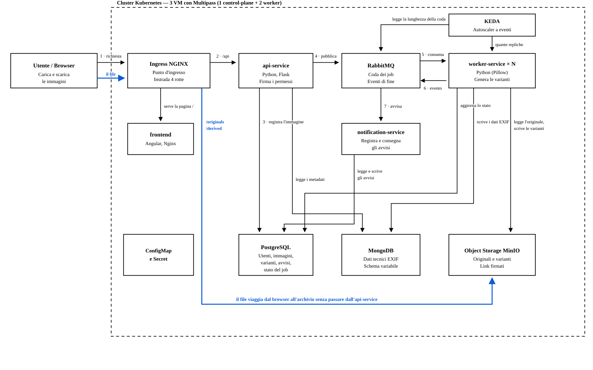

# Piattaforma di elaborazione immagini

Progetto per il corso di Sistemi Cloud. L'utente carica immagini e il sistema
genera automaticamente tre versioni derivate (miniatura, versione media, versione
grande con filigrana), estraendo nello stesso tempo i metadati tecnici EXIF. Le
immagini finali arrivano in una libreria personale filtrabile.

Lo stesso applicativo è distribuito in **due ambienti**, con lo stesso codice e lo
stesso chart Helm: un cluster Kubernetes costruito a mano su tre macchine
virtuali Multipass, e un'infrastruttura AWS fatta di servizi gestiti.



## Flusso di una richiesta

1. Il browser chiama l'ingresso (Ingress NGINX in locale, ALB su AWS).
2. L'ingresso instrada `/` al frontend e `/api` all'`api-service`.
3. L'`api-service` registra l'immagine sul database relazionale.
4. Pubblica il lavoro in coda e risponde subito: `202` con l'identificativo.
5. Un `worker-service` consuma il messaggio e genera le varianti.
6. Il worker scrive i file sull'object storage e i metadati EXIF sul documentale.
7. Il `notification-service` avvisa l'utente a elaborazione conclusa.

Il frontend segue l'avanzamento in polling sullo stato. Il file non passa mai
dall'API: il browser lo carica direttamente sull'object storage con un link
firmato temporaneo.

## Le scelte su cui poggia tutto

- **Elaborazione asincrona.** Registrare un'immagine richiede ~36 ms, generarne le
  varianti ~2 s: le due cose non stanno nella stessa richiesta HTTP.
- **Worker senza stato**, che scalano sulla lunghezza della coda (KEDA) e non sul
  processore.
- **Doppia persistenza.** PostgreSQL per ciò che ha relazioni; il documentale per
  i metadati EXIF, che hanno una forma diversa a seconda della fotocamera.
- **Affidabilità della coda.** Conferma manuale dopo il lavoro, tentativi contati,
  dead letter queue e consumatori idempotenti: un guasto non perde né duplica.

## I due ambienti a confronto

| | Locale | AWS |
|---|---|---|
| Cluster | 3 VM Multipass, `kubeadm` | Amazon EKS in Auto Mode |
| Ingresso | Ingress NGINX | Application Load Balancer |
| Relazionale | PostgreSQL | Amazon RDS |
| Documentale | MongoDB | DynamoDB |
| Coda | RabbitMQ | Amazon MQ |
| Object storage | MinIO | Amazon S3 |
| Immagini | importate a mano nei nodi | Amazon ECR |
| Segreti | ConfigMap e Secret | Secrets Manager, e nessuna chiave: IRSA |
| Avvisi | registro del servizio | Amazon SNS |
| Automazione | Ansible + Terraform | Terraform + GitHub Actions |

In locale i dati vivono *dentro* il cluster; su AWS *accanto*. Si può distruggere
EKS e ritrovare utenti e immagini in RDS e S3.

## Tre modi di farlo girare

### 1. Docker compose — per sviluppare

Serve solo Docker.

```bash
cd deploy/compose
cp .env.example .env      # credenziali di sviluppo, .env non è versionato
docker compose up --build
```

| Indirizzo | Servizio |
|---|---|
| http://localhost:8080 | frontend (e `/api` in proxy verso l'api-service) |
| http://localhost:8000/api/health/ready | readiness dell'api-service |
| http://localhost:15672 | console RabbitMQ |
| http://localhost:9001 | console MinIO |

Per fermare tutto e cancellare anche i dati: `docker compose down -v`.

### 2. Il cluster Kubernetes locale

Servono `multipass`, `ansible`, `terraform` e Docker sul Mac. Ansible crea e
configura le macchine, Terraform installa l'applicazione attraverso Helm.

```bash
cd deploy/ansible && ansible-playbook site.yml      # crea le VM e il cluster (~7 min)
deploy/cluster/app.sh secrets                        # genera le credenziali, una volta
deploy/cluster/images.sh export                      # costruisce le immagini (serve Docker)
deploy/cluster/images.sh load                        # le porta nei nodi (~25 s)
cd deploy/terraform/local && terraform init && terraform apply    # ~2 min
```

Poi si apre `http://media-platform.test`. Il nome di dominio va messo a mano in
`/etc/hosts`: scrivere lì chiede i permessi di amministratore, e Multipass
riassegna gli indirizzi a ogni ricreazione. Il playbook stampa la riga esatta da
eseguire.

Le immagini viaggiano come file perché questo cluster non ha un registro: le
macchine virtuali non vedono il Docker del Mac. Su AWS quel passo sparisce.

Per rimuovere tutto: `deploy/cluster/cluster.sh destroy`.

### 3. AWS

Servono un account AWS e le credenziali configurate (`aws configure`). Le
istruzioni complete sono in [deploy/terraform/aws/README.md](deploy/terraform/aws/README.md);
in breve:

```bash
deploy/terraform/aws/tf.sh bootstrap                 # il bucket dello stato, una volta
deploy/terraform/aws/tf.sh infra apply               # rete, EKS, RDS, MQ, S3... (~15 min)
TAG=$(deploy/terraform/aws/images.sh)                # costruisce e carica su ECR
deploy/terraform/aws/tf.sh app apply -var image_tag="$TAG"
deploy/terraform/aws/tf.sh app output -raw app_url   # l'indirizzo dell'applicazione
```

> **Costa circa 0,48 USD l'ora finché è acceso**, quasi tutto per il broker, il
> piano di controllo di EKS e un nodo. Si spegne con `tf.sh app destroy` e poi
> `tf.sh infra destroy`, e conviene farlo appena finito.

Due cose da sapere, entrambe spiegate nel README di `deploy/terraform/aws/`:

- Le immagini sono costruite per **x86** anche su un Mac ARM, perché il piano
  gratuito di AWS accetta solo alcune famiglie di macchine e EKS Auto Mode
  rifiuta le taglie piccole: l'intersezione delle due regole sono le `*-flex.large`.
- Le scelte personali (indirizzo email per gli avvisi SNS, repository GitHub che
  può distribuire) vanno in `deploy/terraform/aws/infra/locale.auto.tfvars`, che
  git ignora. Senza quel file semplicemente non vengono create.

## Verificare che funzioni

Sei domande diverse, sei strumenti.

| Domanda | Comando | Risposta attesa |
|---|---|---|
| Il codice fa quello che deve? | `scripts/test.sh all` | 89 unità, 19 frontend, 62 integrazione |
| Il giro completo funziona? | `deploy/cluster/smoke.sh` | 11 passi, dalla registrazione all'avviso (anche su AWS, con `BASE=<indirizzo>`) |
| Si comporta come su compose? | `deploy/cluster/app.sh test` | gli stessi test, dentro il cluster |
| Regge quando qualcosa si rompe? | `deploy/cluster/faults.sh` | 5 guasti veri, niente perso né duplicato |
| Regge il carico? | `deploy/cluster/load.sh` · `deploy/terraform/aws/load.sh` | 200 immagini al minuto, con k6 |
| Scala davvero? | `deploy/cluster/burst.sh` | le repliche salgono con la coda |

I test di integrazione girano su uno stack di prova separato, che nasce vuoto e
non tocca quello di sviluppo. Tutti i comandi e il loro perché in
[tests/README.md](tests/README.md).

### A ogni push, da sola

`.github/workflows/verifica.yml` esegue in due lavori paralleli ciò che si può
controllare senza un cluster: stile, unità, frontend e integrazione; poi il chart
Helm (compreso un test che pretende un **fallimento** senza credenziali),
Terraform e i playbook.

I comandi sono gli stessi che si lanciano a mano, di proposito: se la pipeline
avesse i propri, prima o poi i due elenchi divergerebbero.

`.github/workflows/distribuzione.yml` costruisce le immagini, le carica su ECR e
installa l'applicazione su EKS. Si avvia a mano, e non usa nessuna chiave di
accesso: GitHub firma un token per ogni esecuzione e AWS lo scambia con
credenziali temporanee (OIDC). Richiede le due variabili di repository
`AWS_ROLE_ARN` e `AWS_REGION`.

## Cosa è stato misurato

| | Locale | AWS |
|---|---|---|
| Presa in carico di un'immagine (mediana) | 36 ms | 507 ms (la distanza) |
| Elaborazione completa (mediana) | 2,05 s | 2,65 s |
| 200 immagini al minuto | 1 worker basta | l'autoscaler sale a 3 |
| 600 immagini/min, 1 worker | 154,0 s | 194,4 s |
| 600 immagini/min, con autoscaling | 113,4 s | **71,6 s** |
| Guadagno dell'autoscaling | 1,36× | **2,7×** |
| Immagini fallite in tutte le prove | 0 | 0 |

Il divario fra 1,36× e 2,7× ha una causa precisa: in locale ogni nodo ha due
processori, condivisi con database, broker e archivio, quindi *si aggiungono
worker, non processori*. Su AWS l'autoscaler del cluster aggiunge anche le
macchine: nella prova a 600 al minuto, al 45° secondo il cluster ne ha acceso
una seconda da solo.

## Segreti

Nessun segreto è versionato. Dove stanno:

| Ambiente | Dove |
|---|---|
| Sviluppo (compose) | `deploy/compose/.env`, ignorato da git; l'esempio è `.env.example` |
| Test | `deploy/compose/.env.test`, versionato apposta: valori usa e getta |
| Cluster locale | `deploy/helm/values.local.yaml`, generato con valori casuali da `app.sh secrets`, ignorato da git |
| AWS | Secrets Manager, generati da Terraform; per S3, DynamoDB e SNS nessuna chiave: i pod assumono un ruolo IAM (IRSA) |

Lo **stato di Terraform contiene le password in chiaro**: per questo è ignorato da
git in locale e, su AWS, sta in un bucket S3 cifrato con le versioni attive.

## Struttura

```
docs/                     gli schemi architetturali
services/
  common/                 media-common: adapter condivisi (storage, coda, documentale)
  frontend/               Angular servito da Nginx
  api-service/            Python + Flask
  worker-service/         Python + Pillow
  notification-service/   Python
deploy/
  compose/                sviluppo rapido senza Kubernetes
  helm/                   chart dell'applicazione (un solo chart, due ambienti)
  cluster/                script di costruzione e di verifica del cluster locale
  terraform/local/        applicazione sul cluster locale
  terraform/aws/          infrastruttura AWS: rete, EKS, RDS, MQ, DynamoDB, S3...
  ansible/                creazione e configurazione dei nodi locali
tests/integration/        il sistema intero, su uno stack di prova
tests/load/               test di carico con k6
scripts/test.sh           un comando per tutti i test
.github/workflows/        CI e distribuzione
```

Ogni servizio ha il proprio `README.md` con le variabili d'ambiente che si
aspetta e le scelte che lo riguardano. I commenti nel codice sono in italiano,
compresi quelli che spiegano *perché* una scelta è stata fatta: sono il modo in
cui il progetto si documenta.
